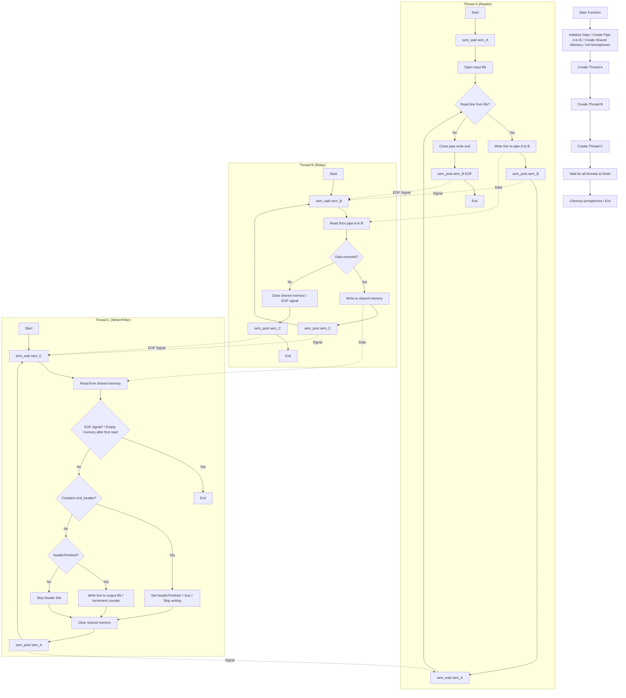

# Thread Pipeline Flow

The following Mermaid diagram shows the execution flow for the three-thread pipeline in `assignment2_template.c`.

```mermaid
flowchart TD
    %% Main Function Flow
    A[Main Function] --> B[Initialize Data / Create Pipe A to B / Create Shared Memory / Init Semaphores]
    B --> C[Create Thread A]
    C --> D[Create Thread B]
    D --> E[Create Thread C]
    E --> F[Wait for all threads to finish]
    F --> G[Cleanup semaphores / Exit]

    %% Thread A Flow
    subgraph ThreadA["Thread A (Reader)"]
        H[Start] --> I[sem_wait sem_A]
        I --> J[Open input file]
        J --> K{Read line from file?}
        K -->|Yes| L[Write line to pipe A to B]
        L --> M[sem_post sem_B]
        M --> N[sem_wait sem_A]
        N --> K
        K -->|No| O[Close pipe write end]
        O --> P[sem_post sem_B EOF]
        P --> Q[Exit]
    end

    %% Thread B Flow
    subgraph ThreadB["Thread B (Relay)"]
        R[Start] --> S[sem_wait sem_B]
        S --> T[Read from pipe A to B]
        T --> U{Data received?}
        U -->|Yes| V[Write to shared memory]
        V --> W[sem_post sem_C]
        W --> S
        U -->|No| X[Clear shared memory / EOF signal]
        X --> Y[sem_post sem_C]
        Y --> Z[Exit]
    end

    %% Thread C Flow
    subgraph ThreadC["Thread C (Writer/Filter)"]
        AA[Start] --> BB[sem_wait sem_C]
        BB --> CC[Read from shared memory]
        CC --> DD{EOF signal? / Empty memory after first read}
        DD -->|Yes| EE[Exit]
        DD -->|No| FF{Contains end_header?}
        FF -->|Yes| GG[Set headerFinished = true / Skip writing]
        FF -->|No| HH{headerFinished?}
        HH -->|Yes| II[Write line to output file / Increment counter]
        HH -->|No| JJ[Skip header line]
        GG --> KK
        II --> KK
        JJ --> KK
        KK[Clear shared memory]
        KK --> LL[sem_post sem_A]
        LL --> BB
    end

    %% Data Flow Connections
    L -.->|Data| T
    V -.->|Data| CC

    %% Synchronization Flow
    M -.->|Signal| S
    W -.->|Signal| BB
    LL -.->|Signal| N
    P -.->|EOF Signal| S
    Y -.->|EOF Signal| BB
```
